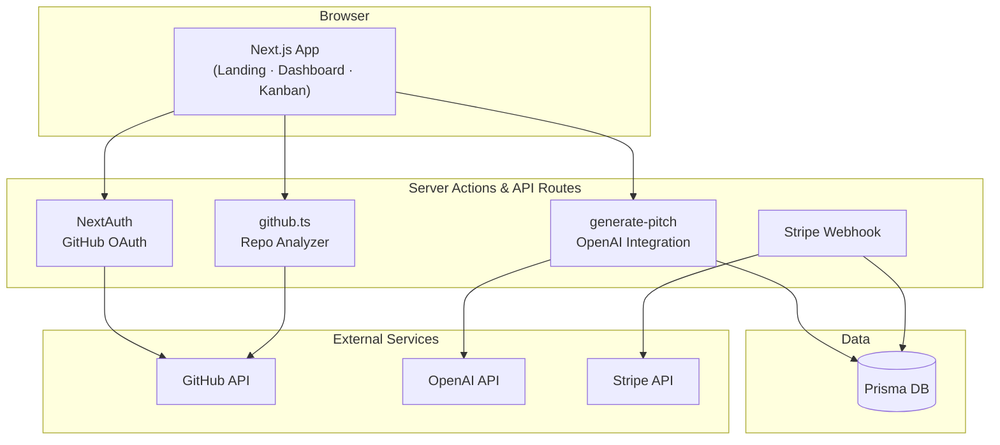

<div align="center">

# DevPitch AI

**AI-powered GitHub profile analysis and professional cover letter generator — Micro-SaaS**

[](https://nextjs.org/)
[](https://www.typescriptlang.org/)
[](https://prisma.io/)
[](https://openai.com/)
[](https://stripe.com/)
[](LICENSE)

[Architecture](#-architecture) · [Installation](#-installation--usage) · [Security](#-security-considerations) · [Contributing](./CONTRIBUTING.md)

</div>

---

## Elevator Pitch

**DevPitch AI** analyzes your GitHub repositories and LinkedIn profile, then generates tailored, professional cover letters for international job applications. Credit-based monetization via Stripe, Kanban-style application tracking, and multi-language support (TR/EN) — built as a production-grade Next.js Micro-SaaS.

---

## Features

| Feature | Description |
|---------|-------------|
| **GitHub Analysis** | Repository scanning, language detection, contribution patterns |
| **LinkedIn PDF Parsing** | Upload career history for context-aware letter generation |
| **AI Cover Letters** | OpenAI GPT-4o-mini with Modern / Classic / Creative templates |
| **Kanban Board** | Drag-and-drop job application pipeline tracking |
| **Stripe Billing** | Credit-based subscriptions and one-time purchases |
| **i18n** | Turkish and English with next-intl |
| **Dark Mode** | next-themes light/dark toggle |
| **Rich Editor** | TipTap WYSIWYG for letter customization |

---

## Tech Stack

| Layer | Technology |
|-------|------------|
| Framework | Next.js 15 (App Router), TypeScript |
| Auth | NextAuth.js (GitHub OAuth) |
| Database | Prisma ORM (SQLite dev / PostgreSQL prod) |
| AI | OpenAI GPT-4o-mini |
| Payments | Stripe (webhooks, checkout) |
| UI | Tailwind CSS, Radix UI, Framer Motion |
| i18n | next-intl |

---

## Architecture



---

## Installation & Usage

### Prerequisites

- Node.js 20+
- npm or pnpm
- GitHub OAuth App
- OpenAI API key
- Stripe account (test mode)

### Local Development

```bash
git clone https://github.com/mertturkel234/devpitch-ai.git
cd devpitch-ai
npm install
cp .env.example .env.local
# Fill in all required variables (see below)
npx prisma db push
npm run dev
```

Open [http://localhost:3000](http://localhost:3000).

### Environment Variables

| Variable | Required | Description |
|----------|----------|-------------|
| `DATABASE_URL` | ✅ | Prisma database URL |
| `NEXTAUTH_URL` | ✅ | App URL (`http://localhost:3000`) |
| `NEXTAUTH_SECRET` | ✅ | Random secret (`openssl rand -base64 32`) |
| `GITHUB_ID` | ✅ | GitHub OAuth Client ID |
| `GITHUB_SECRET` | ✅ | GitHub OAuth Client Secret |
| `OPENAI_API_KEY` | ✅ | OpenAI API key (gpt-4o-mini access) |
| `STRIPE_SECRET_KEY` | ✅ | Stripe secret key |
| `STRIPE_WEBHOOK_SECRET` | ✅ | Stripe webhook signing secret |
| `NEXT_PUBLIC_APP_URL` | ✅ | Public app URL for Stripe redirects |

See [.env.example](./.env.example) for the full template.

### Vercel Deployment

```bash
npm i -g vercel
vercel login
vercel
```

> **Note:** For production, migrate Prisma provider from SQLite to PostgreSQL ([Neon](https://neon.tech/) or [Supabase](https://supabase.com/)).

---

## Security Considerations

- **OAuth flow:** GitHub authentication via NextAuth with secure session cookies.
- **API key isolation:** OpenAI, Stripe, and GitHub secrets stored in environment variables only.
- **Stripe webhooks:** Signature verification via `STRIPE_WEBHOOK_SECRET` on all webhook endpoints.
- **Input sanitization:** User-uploaded PDFs and job descriptions validated before AI processing.
- **Rate limiting:** Credit-based system prevents unbounded API consumption.
- **No client-side secrets:** All sensitive keys are server-side only (`NEXTAUTH_SECRET`, `STRIPE_SECRET_KEY`, `OPENAI_API_KEY`).

See [SECURITY.md](./SECURITY.md) for vulnerability reporting.

---

## Contributing

See [CONTRIBUTING.md](./CONTRIBUTING.md). Conventional Commits + feature-branch PRs required.

---

## License

MIT License
